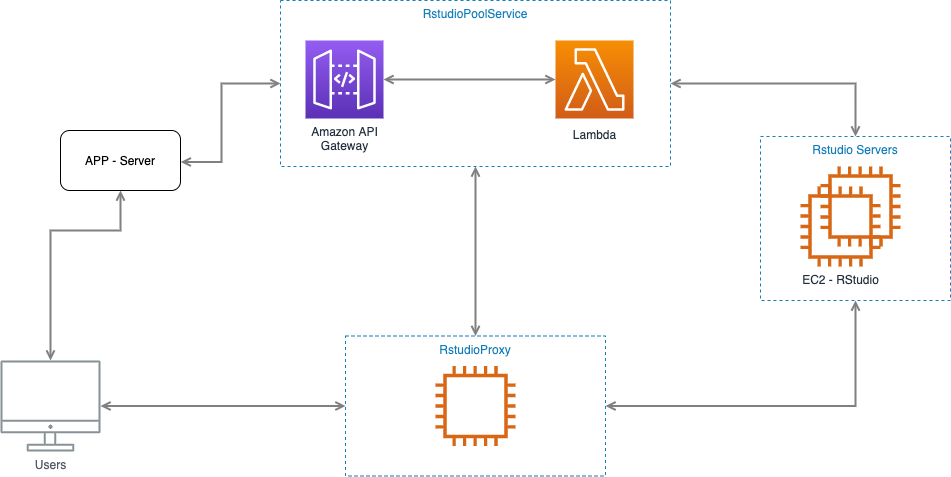

# rstudio-pool-service

## Purpose

A pool of RStudio instances is needed to run analysis in parallel by different people. The pieces of software described in this document solve that problem by assigning, creating, and running EC2 Instances with RStudio, dispatching the traffic between these instances, based on the owner, and also controlling the cost by applying some policies like the size of the pool, and max time idle.



## RStudioPoolService

This is the manager of the pool of instances. It has the responsibility of assign, create, terminate the instances when is needed.

### **How is it build?**

RStudioPoolService is built using [lambda](https://aws.amazon.com/lambda/) with [SAM](https://aws.amazon.com/serverless/sam/), which is the framework to work with lambdas. All of this is deployed using [CodeBuild](https://aws.amazon.com/codebuild/). Lambda functions are exposed to an API [Gateway](https://aws.amazon.com/api-gateway/).

### **How is the interface of this service?**

This system listens to POST HTTP requests, which should contain a command and a payload into the body. This is the list of the commands:

- REQUEST_RSTUDIO

    This command is to request the creation or assignation of an instance. This command should be called from the app that needs to assign an RStudio instance to its users.

    ```jsx
    { "command": "REQUEST_RSTUDIO", "payload": { "userId": '1234-abcd' } }
    return 200 OK { "instanceId": 'i-1234' }
    ```

    If the user already has an instance assigned, this handler is going to return this instance. If the user hasn't got any instance, and there is free space on the pool, a new one will be assigned/created, and the id returned. It also ensures a number of free instances to assign then faster when they are needed.

- GET_STATUS

    This command handler is responsible for returning the information of the pool to help other services to work. There are two cases:

    Some services should know the ids of the instances assigned to check if the instance requested exists and recreate the timers if the system gets down.

    ```jsx
    { "command": "GET_STATUS", "payload": {} }
    return 200 OK {"instances": ["i-1234", "i-5678"] }
    ```

    The next command should be used to ask information about some instance:

    ```jsx
    { "command": "GET_STATUS", "payload": {"instanceId": "i-1234"} }
    return 200 OK 
    	{
    		"instance": { 
    			"instanceId": "i-1234",
    			"url": "public-dns-url",
    			"keyName": "keyName",
    			...tags // userId, ...
    		}
    }
    ```

- DELETE

Once the proxy detects that some instance is idle, it sends a command to the pool service to kill the instance.

```jsx
{ "command": "DELETE", "payload": {"instanceId": "i-1234"} }
return 200 OK {"status": "OK" }
```

### **How is the code structured?**

```jsx
./src
.../domain
.../handlers
.../infrastructure
.../useCases
template.yml
buildspec.yml
package.json
```

- Domain: Contains the functions to manage the Instances.
- Handlers: Catches the requests and runs the right command handler.
- Infrastructure: Connects the Service with AWS to manage the instances.
- useCases: Business logic that uses the Instance manager and model to manage the RStudio instances.
- template.yml: SAM template to describe de infrastructure.
- buildspect.yml: File used to build and deploy the service.

### **How is this RStudio instance create?**

The instances are created using the EC2 client of AWS CLI. Into the `./infrastructure/awsEc2`, a `createInstance` function can be found. The instance config is passed as param from outside. It makes the code of this `createInstance`reusable for other configs. The config for an RStudio is like the next piece of code:

```jsx
{
  ImageId: 'ami-0130bec6e5047f596', // this iam can be found right to the name of the instance when a new instance is launched by hand, this id is unique by region
  InstanceType: 't2.micro', // size of the instance
  KeyName: KEY_NAME,
  MaxCount: 1,
  MinCount: 1,
  SecurityGroupIds: [SECURTY_GROUP], // security group created on step 3
  IamInstanceProfile: {
    Name: INSTANCE_PROFILE,
  },
  UserData: `#!/bin/bash
    sudo mkdir /home/ubuntu/docker-runner
    cd /home/ubuntu/docker-runner
    sudo chown -R $USER:$USER /home/ubuntu/docker-runner
    sudo apt-get update
    curl -fsSL https://get.docker.com -o get-docker.sh
    sudo sh get-docker.sh
    sudo service docker start
    sudo chmod 666 /var/run/docker.sock
    sudo apt install awscli -y
    aws ecr get-login-password --region ${REGION} | docker login --username AWS --password-stdin ${ACCOUNT}
    docker pull ${ACCOUNT}/rstudio
    sudo docker run -d -p 8787:8787 -e DISABLE_AUTH=true ${ACCOUNT}/rstudio
 `,
  TagSpecifications: [
    {
      ResourceType: 'instance',
      Tags: [
        {
          Key: 'Purpose',
          Value: 'RStudio',
        },
       ...
      ],
    },
  ],
}
```

As we can see the are many parts that came from configuration:

- ImageId:  this is the image id that we use as a base it comes from the AWS catalog
- InstanceType: size of the instance
- KeyName: key `*.pem` used to access with ssh into the EC2 instance
- SecurityGroupIds: security group of the instance. This security group defines the network rules used by the instance. As we are using an RStudio server, the rules are TPC, 8787, Anywhere and ssh, 22, Anywhere.
- IamInstanceProfile: AWS Profile used to give policies to the instance.
- UserData: This is the script that is run just after the start of the instance. With this script, docker and awscli are installed. The instance runs authentication to ECR to have the authorization to pull the Rstudio docker from the private registry. Then this docker is run with the 8787 port exposed.

### **How is this service deployment?**

This service is deployed using CodeBuild, which listens to Github pushes and runs the file `buildspec.yml` found on the service root folder. This file has different phases. Into the build phase, the SAM template of the application is translated into a cloud formation template, and then this file is used in the post_build phase to deploy the SAM application.

### How to configure the pool service?

The env vars are configured on AWS Console:

1. Open AWS Console on the right region.
2. Go to CodeBuild.
3. CodeBuild > compilation > BuildProjects.
4. Open the PoolService build project.
5. On the top part, click on Edit > Environment.
6. Additional configuration > scroll to Environment variables.
7. Fill the env vars and save.

```jsx
MIN_FREE_INSTANCES=3
MAX_INSTANCES=6
IMAGE_ID="ami-0130bec6e5047f596"
IMAGE_TYPE="t2.micro"
REGION="eu-central-1"
ACCOUNT="XXXXXXX.dkr.ecr.eu-central-1.amazonaws.com"
SECURITY_GROUP="sg-1234aa12a123ab123"
INSTANCE_PROFILE="ec2-admin"
KEY_NAME="LambdaInstance"
```

the env vars are propagated to the .env file with `printenv > .env` command into the buildspec.yml 

### How to run locally?

1. On the root folder of the PoolService run `sam build`
2. run `sam local start-api`. Some params could be needed like 

`sam local start-api --profile awsprofile --region eu-central-1 -p 3001`

Now a server is an app with the PoolService.

## RStudioProxy

This is the proxy used to dispatch the traffic between the RStudio instances based on the URL requested.

### **How is it build?**

It is a nodejs-express server that uses the `[http-proxy-middleware](https://github.com/chimurai/http-proxy-middleware)` .
All of the requests are taken, and 3 middlewares are applied:

- `getInstanceMiddleware`: check if the 'request's path belongs to some RStudio instance and, in that case, populate the request with the instance and instanceId information.
- `timeoutMiddleware`: initializes the timmers if they are not initialized yet and restart the requested instance's timmer.
- `createProxyMiddleware`:  this is the proxy middleware provided by the `http-proxy-middleware`, we pass some config.

### How is the proxy config passed to the proxy?

```jsx
const config = {
  target: DEFAULT_URL,
  router: customRouter,
  changeOrigin: true,
  pathRewrite: rewriteFn,
}
```

- target: All of the requests are going to be redirected by default to this target url.
- router: we defined a customRouter which takes the information provided by the previous middlewares, the instance and the instanceId, and extracting the public address of the instance the destination address is created. This URL is building taking the `ROUTE_TO_REPLACE` from the config and replacing the text defined by the var `STRING_TO_REPLACE` with the public URL of the instance.
- changeOrigin: changes the origin of the host header to the target URL.
- pathRewrite: rewrite the target's URL path. We rewrite all of the requests done inside the instance to remove the path's instance to redirect the request to the right path.

### **How is the code structured?**

```jsx
./src
.../infrastructure
.../domain
...../Instance
...../Proxy
...../Timmer
buildspec.yml
config.js
package.json
Procfile
```

- Infrastructure: Functions to create and send the commands to communicate with the PoolService
- domain: Contains the folders of the different entities of the system. Timer, Proxy, and Instance. Each folder has a Model and a Service, and the middlewares are exported to be used by the server.
- buildspec.yml: Contains the information needed to build and deploy the proxy
- config.js: Contains the vars needed to config the proxy

    ```jsx
    module.exports = {
      PORT: process.env.PORT || 8081,
      DEFAULT_URL: process.env.DEFAULT_URL,
      SERVICE_URL: process.env.SERVICE_URL,
      STRING_TO_REPLACE: process.env.STRING_TO_REPLACE,
      ROUTE_TO_REPLACE: process.env.ROUTE_TO_REPLACE,
      TIMEOUT_INSTANCE: process.env.TIMEOUT_INSTANCE,
    }
    ```

- Procfile, defines the command needed to run the service after the build

### **How is this service deployment?**

This service is deployed using CodeBuild, which listens to Github pushes and runs the file `buildspec.yml` that can be fount on the service root folder. And the application uses [Elasticbeanstalk](https://aws.amazon.com/elasticbeanstalk/) to run. Into this file the are some steps:

- install:  awsebcli is installed in order to run elasticbeanstalk.
- pre-build: elasticbeanstalk is initialized, it creates a machine to run the code
- build:
- post_build: the application is deployed using elasticbeanstalk

### How to configure the proxy service?

This is the .env file:

```jsx
PORT=8081
DEFAULT_URL="http://www.example.org"
SERVICE_URL="url_to_the_pool_service"
ROUTE_TO_REPLACE="http://REPLACE_ME:8787/"
STRING_TO_REPLACE="REPLACE_ME"
TIMEOUT_INSTANCE=60000
```

This is the config file:

```jsx
module.exports = {
  PORT: process.env.PORT || 8081,
  DEFAULT_URL: process.env.DEFAULT_URL,
  SERVICE_URL: process.env.SERVICE_URL,
  ROUTE_TO_REPLACE: process.env.ROUTE_TO_REPLACE,
	STRING_TO_REPLACE: process.env.STRING_TO_REPLACE,
  TIMEOUT_INSTANCE: process.env.TIMEOUT_INSTANCE,
}
```

To change the vars, we should go to the [AWS Console, open ElasticBeanstalk in the right zone](https://eu-central-1.console.aws.amazon.com/elasticbeanstalk/home?region=eu-central-1#/environments), and then open the Application and the environment. Inside of this environment, you should go to settings > software > edit. In this screen, go to Environment properties, and update the vars.

### How to run locally?

1. set the .env file on the root folder of the proxy
2. run the npm run start

## RStudio Docker

The RStudioPoolService creates EC2 instances that run a docker with the custom RStudio server with some packages installed to do the experience to the user better and faster. 

The process to update the Docker image is as follow:

```jsx
aws ecr get-login-password --region eu-central-1 --profile profile | docker login --username AWS --password-stdin XXXXXXX.dkr.ecr.eu-central-1.amazonaws.com
docker build -t rstudio .
docker tag rstudio:latest XXXXXXX.dkr.ecr.eu-central-1.amazonaws.com/rstudio:latest
docker push XXXXXXX.dkr.ecr.eu-central-1.amazonaws.com/rstudio:latest
```

Login to [ECR](https://aws.amazon.com/ecr/) which is the Docker Container Registry 

Build the image with this Dockerfile. We can install more packages:

```jsx
FROM rocker/rstudio:3.6.2
RUN install2.r --error dplyr
RUN install2.r --error \
    sqldf \
    jsonlite \
    httr \
    zip
```

Tag this new image and push it to the registry.

---


Add Purpose as config on the proxy and parameter on the Service 
also pass as Config the Docker image and the docker run command or generate some strategy based on the Purpose
